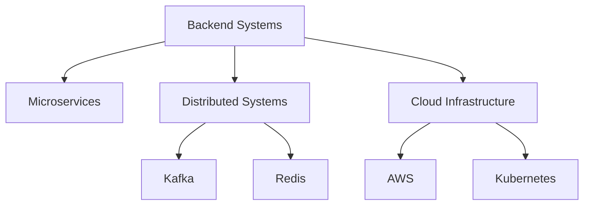

<div align="center">

# Harish Nandha Kumar

### Backend Engineer • Distributed Systems • Cloud Infrastructure


<br>

[](https://www.linkedin.com/in/harish-n-kumar/)
[](mailto:harishkumar2171@gmail.com)

</div>

---

# Engineering Philosophy

```java
while (alive) {
    learn();
    build();
    optimize();
    scale();
}
```

I enjoy building systems that operate reliably under load.

My work spans:

⚡ Distributed Systems

⚡ Backend Engineering

⚡ Systems Programming

⚡ Cloud Infrastructure

⚡ Platform Engineering

---

# Current Tech Stack

```text
Languages
├── Java
├── Go
├── C
├── Python
├── TypeScript
└── SQL

Backend
├── Spring Boot
├── Express.js
├── REST APIs
├── gRPC
├── JWT
└── Kafka

Cloud
├── AWS
├── Docker
├── Kubernetes
├── Redis
├── PostgreSQL
└── GitHub Actions
```

---

# Featured Engineering Projects

## FUSE File System

```bash
Built from scratch in C

✓ Custom inode architecture
✓ Block allocation engine
✓ Directory traversal
✓ POSIX filesystem operations
✓ 40+ automated tests
```

---

## Multi-Threaded Database Server

```bash
Concurrent key-value database

✓ TCP sockets
✓ Producer-consumer architecture
✓ Thread synchronization
✓ Persistent storage engine
✓ Custom binary protocol
```

---

## Cloud-Native Task Platform

```bash
Production-grade SaaS platform

✓ PostgreSQL
✓ Redis caching
✓ OAuth
✓ Rate limiting
✓ CI/CD automation
✓ Background scheduling
```

---

## Spring Boot Microservices

```bash
Event-driven healthcare platform

✓ Kafka messaging
✓ gRPC communication
✓ JWT authentication
✓ Docker deployment
✓ Distributed architecture
```

---

# System Design Interests



---

# GitHub Analytics

<div align="center">


</div>

---

# Contribution Graph

<div align="center">


</div>

---

# Currently Learning

```yaml
2026:
  - Advanced Spring Boot
  - Apache Kafka
  - Kubernetes
  - AWS Architecture
  - Distributed System Design
  - Large Scale Backend Systems
```

---

# Open To

```text
Backend Engineer
Software Engineer
Platform Engineer
Cloud Engineer
Distributed Systems Engineer
```

---

<div align="center">

### "First make it work. Then make it fast. Then make it scale."

</div>
